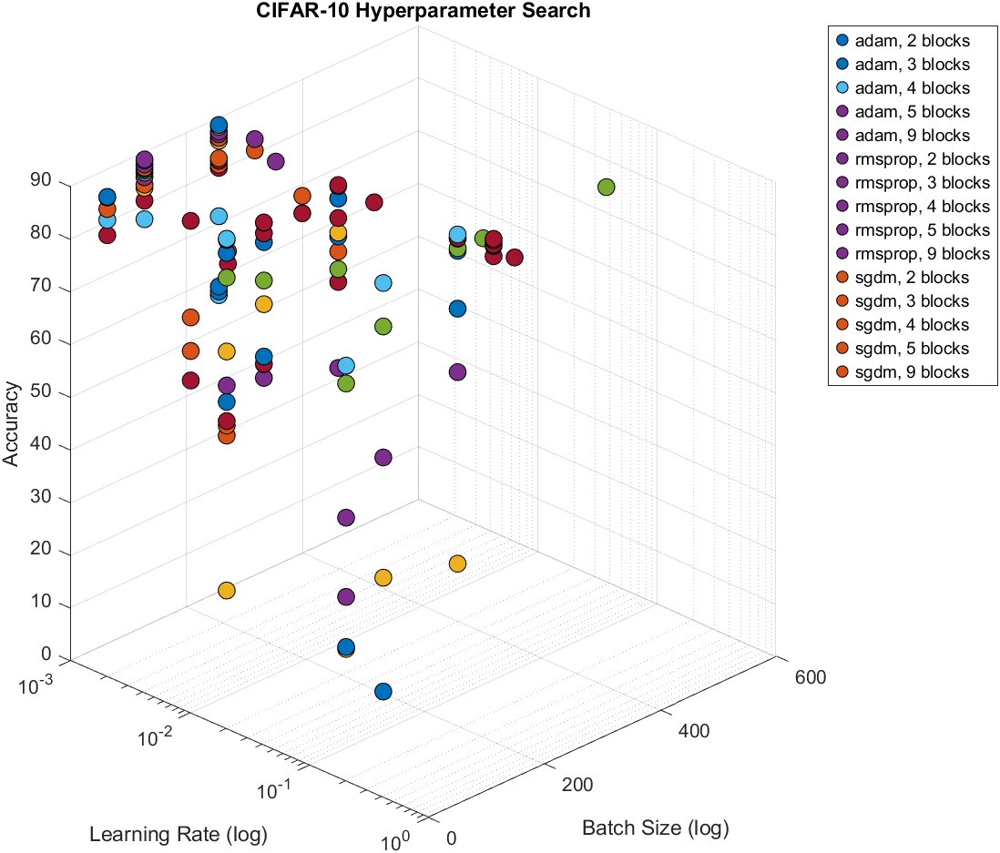

# Image Processing with CNN on CIFAR-10 Using MATLAB

*(Repository authored by Diaa Ahmed Masoud)*

##  Overview

This project explores image classification on the CIFAR-10 dataset using Convolutional Neural Networks (CNN) in MATLAB. It includes several neural network architectures implemented via MATLAB Live Scripts (`.mlx`), varying in depth and complexity. Features:

- Live scripts for different network configurations: 2-CNN Blocks, 3-CNN Blocks, 4-CNN Blocks, 4-CNN Blocks+ Dense Block, and 8-CNN Blocks+ Dense Block.
- A main execution script (`Main.mlx`) to orchestrate training and evaluation over multiple general configurations.
- Script for loading and preprocessing the CIFAR-10 data (`loadtrainingdata.mlx`).
- Script for loading the training configuration `createTrainingOptions.mlx`,
- Experimentation on particular configurations via `testconfigs.mlx`
- Results aggregation and visualisation scripts (`aggregate_results.mlx`, `Scattergraph.mlx`).
-The Best model resulted in an  Accuracy	of 89.86%, a Precision	of 89.84%, a Recall of 89.86% and an F1 Score	of 89.78%
- different testing models are presented in: `Test Output` folder
- An Excel summary of experiments (`experiment_summary.xlsx`) resulted from the `aggregate_results.mlx` file and can be reproduced, given that more tests were done.

### Accuarcy graph based on (optimizer,number of Convolution blocks, Batch size, learning Rate) of the expirments 

### Layer architecture for the `5convlayers.mlx`

### confusion Matrix on Training, Validation and Testing data for the best resulting model

### training curves
.
### Loss Curves
.

